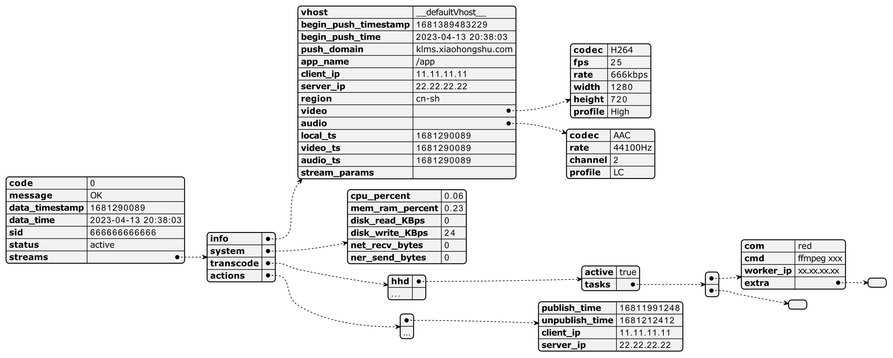

# BeautifulJson

## 简介
本项目基于plantuml([github/plantuml-server](https://github.com/plantuml/plantuml-server))

支持将`.json`格式文件转换成为一个非常直观简洁的`.png`格式的可视化图像，如下图所示：


## 使用方式 （Mac OS系统）

### 安装docker环境
代码默认使用docker镜像本地部署plantuml服务，部署命令：

（参考[github/plantuml-server](https://github.com/plantuml/plantuml-server)利用jetty容器启动plantuml服务）
``` shell
docker run -d -p 8080:8080 --read-only -v /tmp/jetty plantuml/plantuml-server:jetty
```
启动后，可以通过[http://localhost:8080/uml](http://localhost:8080/uml)访问本地部署的plantuml服务

### 安装依赖包
``` shell
pip3 install -r requirements.txt
```

### 安装inkscape
``` shell
brew install inkscape
```

### 开始使用
``` shell
python3 GenUml.py {input_file}
```

例如：
``` shell
python3 GenUml.py ./test.json
```
即可在输入文件同级目录下生成一个`test.png`文件

## 备注
